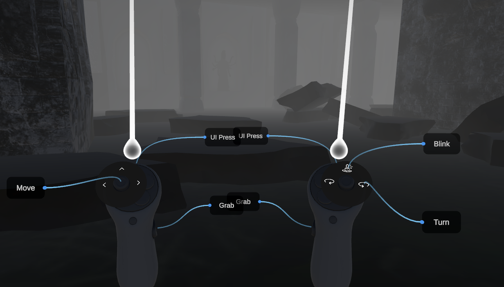

---

## **Table of Contents**
1. [Introduction](#introduction)
2. [Features](#features)
3. [Installation](#installation)
4. [Getting Started](#getting-started)
5. [Basic Controls](#basic-controls)
6. [Troubleshooting](#troubleshooting)
7. [Contact Information](#contact-information)
8. [Authors](#authors)

---

# Introduction


This puzzle game project draws inspiration from the classic *Diamond Rush* and *Sokoban* games. Designed for an immersive virtual reality experience, this VR game challenges players to solve puzzles and reach specific goals. The game utilizes the controllers of the Meta Quest 2 and Meta Quest 3 for an engaging and intuitive gameplay experience.

Supported Platforms:
- Meta Quest 2
- Meta Quest 3
---

## **Features**

- **Immersive Puzzle Mechanics**: Solve dynamic puzzles in a fully 3D environment.
- **VR-Optimized Controls**: Intuitive use of Meta Quest controllers for movement, object manipulation, and interaction.
- **Inspired Design**: Combines mechanics from *Diamond Rush* and *Sokoban* for a modern VR twist.
- **Challenging Gameplay**: Increasing difficulty as players progress through levels.

---

## Installation
Prerequisites:
- Unity Hub installed 2023.x version
- OpenJDK installed
- Android SDK & NDK tools installed
- Meta Quest Developer Hub

To get the project through GitHub.

```bash
  git clone <Repository Link>
```

After that, open the add the project in UnityHub by adding the project from from disk. This can be seen in the top right of the Unity Hub's UI.


## Getting Started
Open the project and make sure to add the appropriate scene to the hierarchy if no assets or environents shows up for a while. After that, build the project as an apk.

Logging in to the headset with one's own meta account. Connect it to the Meta Quest developer app with the same meta account. Drag the apk to the list of downloads.

## Basic Controls


Usual basic controls are for moving with locomotion system by the usage of the joystick.
Grabbing an object is also the usual same button at the side to grab. Moving with joystick while grabbing is allowed. Using the ray indicator is used for where the object can be grabbed to the users.
## Troubleshooting
---
Troubleshooting
**Common Issues**:
- Game not running on Meta Quest:
Ensure your headset is set to Developer Mode.
- Make sure you have installed the correct version of the Oculus XR plugin in Unity.

**Tracking issues:**
- Ensure your play area is well-lit.
- Check for any obstructions that might block the headset's sensors.
- Performance drops:
Reduce graphical settings in Unity if the game stutters or lags.
## Contact Information
For any more problems, these are the links that might help
 - [Unit Home Disccusion](https://discussions.unity.com/)
- [Stack Overflow](https://stackoverflow.com/)
## Authors

- [@Primeputin](https://www.github.com/Primeputin)

