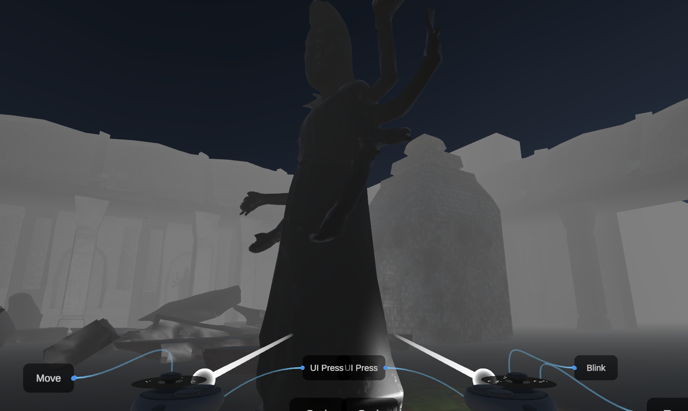

---

## **Table of Contents**
1. [Introduction](#introduction)
2. [Features](#features)
3. [Installation](#installation)
4. [Getting Started](#getting-started)
5. [Basic Controls](#basic-controls)
6. [Troubleshooting](#troubleshooting)
7. [Contact Information](#contact-information)
8. [Authors](#authors)

---

# Introduction

This puzzle game project draws inspiration from the classic *Diamond Rush* and *Sokoban* games. Designed for an immersive virtual reality experience, this VR game challenges players to solve puzzles and reach specific goals. The game utilizes the controllers of the Meta Quest 2 and Meta Quest 3 for an engaging and intuitive gameplay experience.
---

## **Features**

- **Immersive Puzzle Mechanics**: Solve dynamic puzzles in a fully 3D environment.
- **VR-Optimized Controls**: Intuitive use of Meta Quest controllers for movement, object manipulation, and interaction.
- **Inspired Design**: Combines mechanics from *Diamond Rush* and *Sokoban* for a modern VR twist.
- **Interactive Gameplay**: Interactive items to use

---

## Installation
Prerequisites:
- Unity Hub installed 2023.x version
- OpenJDK installed
- Android SDK & NDK tools installed
- Meta Quest Link installed on PC
- Meta Developer Account

Supported Platforms:
- Meta Quest 2
- Meta Quest 3s
- Meta Quest 3

To get the project through GitHub.

```bash
  git clone https://github.com/Primeputin/DiamondRush.git
```

After that, open the add the project in UnityHub by adding the project from from disk. This can be seen in the top right of the Unity Hub's UI.


## Getting Started
Open the project and make sure to add the appropriate scene (called SampleScene) to the hierarchy if no assets or environents shows up for a long while. After that, build the project as an apk.

Logging in to the headset with one's own meta account. Connect it to the Meta Quest Link app with the same meta account again with wire. Make sure the USB Debugging and developer mode on the headset is set on.
- Setting developer mode to be on the headse using your phone to set the headset developer settings to be on. An alternative to this would be setting developer mode on through the settings in the headset itself.
- USB Debugging will show up in the headset once connected with wire successfully with the Meta Quest Link app. Click Confirm. If it doesn't appear, check the notification in the headset.
- When a dialogue appears to enable link, click yes/confirm/enable.

Before building, make sure to **disable the XR Device Simulator**.
After those, build and run in the open project in Unity with the selected meta quest device. It must specified for it work. After that, the game should start running in the headset. Enjoy :)

## Basic Controls
<div style="display: flex; flex-wrap: wrap; justify-content: space-around;">
  
  
  
  
</div>

Usual basic controls are for moving with locomotion system by the usage of the joystick.
Grabbing an object is also the usual same button at the side to grab. Moving with joystick while grabbing is allowed. Using the ray indicator is used for where the object can be grabbed to the users. The ray would turn blue, indicating that you can grab the object.
- Left Thumbstick navigate your virtual environment.
- Right Thumbstick to change facing orientation.
- Meta button for VR headset controllers / oculus icon brings up the universal menu. You can also press and hold Meta button for VR headset controllers / oculus icon to recenter your headset view.
- Grip button (on the side of the controller) grabs objects.
- The back buttons are made for triggering UI interactions.
## Troubleshooting
**Common Issues**:
- Game not running on Meta Quest: Ensure your headset is set to Developer Mode.
- Make sure you have installed the correct version of the Oculus XR plugin in Unity.
- Not Linking to Meta Quest Link: Check if the cable used is of quality.
- Others: a good reset on the PC or headset might just do a trick.

**Tracking issues:**
- Ensure your play area is well-lit.
- Check for any obstructions that might block the headset's sensors.
- Performance drops:
Reduce graphical settings in Unity if the game stutters or lags.
## Contact Information
For any more problems, these are the links that might help
 - [Unit Home Disccusion](https://discussions.unity.com/)
- [Stack Overflow](https://stackoverflow.com/)
- [Setting up Meta Quest Link on the PC](https://www.meta.com/help/quest/articles/headsets-and-accessories/oculus-rift-s/install-app-for-link/?srsltid=AfmBOoqCogVr7pxWfc7Yj0ggWkXcwAMWRVm_eN39XUkx_RHMCSHvrtj7)
## Authors
- [@Primeputin](https://www.github.com/Primeputin)

